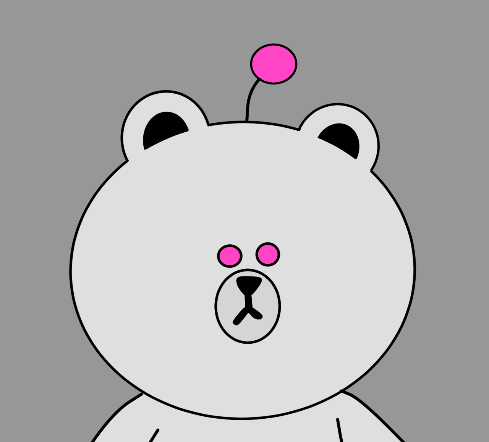

# Kumabot

Hi! This is a KumaBot, a messenger bot written in Golang for LINE Messenger. He is not so smart now, you can ask him about the weather in different locations, like: "Tell me about the weather in Tokyo" or "What about the weather in Berlin". So he can only understand English and the word "weather" must be there.

And if you say "Ping" KumaBot will respond with "pong" - a simple test.

It's also very simple to teach KumaBot something new, possibilities are endless :)

You can add him on LINE:

